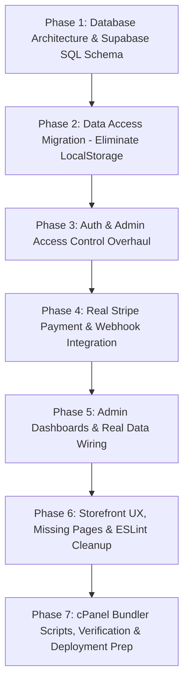

# KIJIJ Multi-Site Platform: Production Readiness, Stripe Integration & cPanel Deployment Plan

---

## 1. Executive Summary & Architecture Specification

### A. Three Independent Domains & Dedicated cPanel Hosting
The platform is composed of **three completely independent web applications**, each hosted on its own cPanel account/document root with its own apex domain:

| Application | Production Domain | Repository Workspace | Primary Purpose | Audience |
| :--- | :--- | :--- | :--- | :--- |
| **Corporate Site** | `https://kijij.com` | `/main-site` | Company profile, executive team, divisions overview, investor relations, global contact. | General public, investors, corporate partners |
| **Coffee Trading Platform** | `https://kijijcoffee.com` | `/coffee-site` | Ethiopian green coffee wholesale, container allocations, sample orders, direct retail coffee purchasing, export logistics, roaster portal. | International coffee importers, roasters, commercial buyers |
| **Leather Goods Store** | `https://kijijleather.com` | `/leather-site` | Direct-to-consumer luxury Ethiopian leather ecommerce, catalog browsing, shopping cart, customer wishlists, order tracking. | Retail luxury consumers worldwide |

> [!IMPORTANT]
> **Independent Apex Domains (Not Subdomains)**:
> Because each application operates under a completely separate top-level domain (`kijij.com`, `kijijcoffee.com`, `kijijleather.com`):
> 1. **Cross-Domain Cookies**: Browsers do not share cookies across distinct apex domains. Sessions on `kijijcoffee.com` will not bleed into `kijijleather.com`. This perfectly enforces the requirement that **B2C retail leather shoppers** and **B2B wholesale coffee buyers** maintain completely separated profiles and accounts.
> 2. **Cross-Domain Navigation**: All inter-site links must use absolute URLs (`https://...`), managed centrally via `shared/site-config.ts`.
> 3. **Supabase Auth Redirect URLs**: The shared Supabase project must have all three domains configured in **Authentication → URL Configuration → Redirect URLs**:
>    - `https://kijij.com/**`
>    - `https://kijijcoffee.com/**`
>    - `https://kijijleather.com/**`

---

### B. Single Centralized Database Backend (Supabase PostgreSQL)
All three applications connect to **one unified Supabase project** (`https://pumkrcqmkygslqjuakcw.supabase.co`):
- **Centralized Inventory & Catalogs**: `coffee_products` and `leather_products` live in the same PostgreSQL database, managed through authenticated admin interfaces.
- **Unified Orders Table**: All financial transactions (coffee direct retail and leather store sales) flow into a single `orders` table partitioned by `site_source: 'coffee' | 'leather'`.
- **Customer Segmentation**:
  - `buyer_companies` & `buyer_addresses`: Attached to coffee roasters/importers.
  - `leather_wishlists` & consumer profiles: Attached to direct retail shoppers (no company info required; shipping addresses provided at checkout).
- **Central Staff & Role-Based Access Control**:
  - `public.staff` table: Central source of truth for administrative credentials. Administrators logging into either `kijijcoffee.com/admin` or `kijijleather.com/admin` are verified server-side against this table, completely eliminating client-side role forgery.

---

### C. Stripe Payment Architecture: Test to Live Mode
Both commercial websites (`kijijcoffee.com` and `kijijleather.com`) will process credit card payments via Stripe:
- **Server-Side Price Validation**: Cart item prices are verified against the database on the server prior to creating Stripe Checkout sessions, preventing any client-side price tampering.
- **Independent Webhooks**:
  - `https://kijijcoffee.com/api/stripe/webhook`
  - `https://kijijleather.com/api/stripe/webhook`
- **Zero-Code Live Switch**: The application uses environment variables for all Stripe keys (`NEXT_PUBLIC_STRIPE_PUBLISHABLE_KEY`, `STRIPE_SECRET_KEY`, `STRIPE_WEBHOOK_SECRET`). Switching from Test mode to Live mode requires **only updating the `.env` values in cPanel** with zero code changes.

---

## 2. cPanel Shared Hosting & Phusion Passenger Deployment Architecture

### A. The Challenge: CloudLinux LVE Resource Limits
On shared cPanel hosting running CloudLinux with LiteSpeed / Phusion Passenger:
- User processes are restricted by strict **LVE (Lightweight Virtual Environment) memory and CPU limits** (typically 1 GB RAM).
- Running `next build` on cPanel triggers:
  ```text
  RangeError: WebAssembly.instantiate(): Out of memory: Cannot allocate Wasm memory for new instance
  Script exit code: 1
  ```
- Running in development mode (`npm run dev`) or compiling TypeScript on the server immediately hits memory ceilings and results in `503 Service Unavailable`.

### B. The Proven Deployment Pattern (Mandatory Standard)
1. **Compile Locally**: Execute `npm run build` locally on development machines where RAM is unrestricted.
2. **Standard Passenger Startup (`server.js`)**: Place a dedicated `server.js` in the root of each app that dynamically binds to `process.env.PORT` and proxies requests to Next.js.
3. **Automated Bundling (`scripts/prepare-cpanel-prebuilt.js`)**: Bundle the compiled `.next` production output, `public/`, `server.js`, `package.json`, and convert `.env.local` to `.env` while stripping `node_modules` and development files into `cpanel-prebuilt/`.
4. **Package & Archive**: Create `cpanel-prebuilt.zip`.
5. **cPanel Execution**: Extract files into the application root, run `npm install --omit=dev` via cPanel's **Setup Node.js App**, and restart Passenger.

---

### C. Required Application Startup File (`server.js`)
Every app root (`main-site/server.js`, `coffee-site/server.js`, `leather-site/server.js`) must feature this exact production server:

```javascript
// server.js - cPanel Node.js Application Startup File
const { createServer } = require("http");
const { parse } = require("url");
const next = require("next");

const dev = false;
const hostname = "0.0.0.0";
const port = parseInt(process.env.PORT, 10) || 3000;

const app = next({ dev, hostname, port });
const handle = app.getRequestHandler();

app.prepare().then(() => {
  createServer(async (req, res) => {
    try {
      const parsedUrl = parse(req.url, true);
      await handle(req, res, parsedUrl);
    } catch (err) {
      console.error("Error handling request:", req.url, err);
      res.statusCode = 500;
      res.end("Internal Server Error");
    }
  })
    .once("error", (err) => {
      console.error("Server startup error:", err);
      process.exit(1);
    })
    .listen(port, () => {
      console.log(`> Production Server ready on port ${port}`);
    });
});
```

---

### D. Automated Bundler Script (`scripts/prepare-cpanel-prebuilt.js`)
This script automates packaging for each workspace:

```javascript
// scripts/prepare-cpanel-prebuilt.js
const fs = require("fs");
const path = require("path");

const ROOT = path.resolve(__dirname, "..");
const DEPLOY_DIR = path.join(ROOT, "cpanel-prebuilt");

// Folders and files to exclude from the upload bundle
const SKIP = new Set([
  "node_modules",
  ".git",
  ".github",
  "cpanel-deploy",
  "cpanel-deploy.zip",
  "cpanel-source",
  "cpanel-source.zip",
  "cpanel-prebuilt",
  "cpanel-prebuilt.zip",
  "tsconfig.tsbuildinfo",
  "scripts",
]);

function copyDirRecursive(src, dest, skipSet) {
  if (!fs.existsSync(dest)) {
    fs.mkdirSync(dest, { recursive: true });
  }
  const entries = fs.readdirSync(src, { withFileTypes: true });
  for (const entry of entries) {
    if (skipSet && skipSet.has(entry.name)) continue;
    const srcPath = path.join(src, entry.name);
    const destPath = path.join(dest, entry.name);
    if (entry.isDirectory()) {
      copyDirRecursive(srcPath, destPath, skipSet);
    } else {
      fs.copyFileSync(srcPath, destPath);
    }
  }
}

console.log("📦 Preparing PRE-BUILT cPanel deployment bundle...");

// 1. Reset staging directory
if (fs.existsSync(DEPLOY_DIR)) {
  fs.rmSync(DEPLOY_DIR, { recursive: true, force: true });
}
fs.mkdirSync(DEPLOY_DIR, { recursive: true });

// 2. Copy project files (including pre-built .next, excluding node_modules)
console.log(" -> Copying project files & pre-built .next directory...");
copyDirRecursive(ROOT, DEPLOY_DIR, SKIP);

// 3. Rename .env.local to .env for production
const envLocal = path.join(DEPLOY_DIR, ".env.local");
const envDest = path.join(DEPLOY_DIR, ".env");
if (fs.existsSync(envLocal)) {
  fs.renameSync(envLocal, envDest);
  console.log(" -> Renamed .env.local to .env");
}

// 4. Ensure root server.js is present
const rootServerJs = path.join(ROOT, "server.js");
if (fs.existsSync(rootServerJs)) {
  fs.copyFileSync(rootServerJs, path.join(DEPLOY_DIR, "server.js"));
  console.log(" -> Copied server.js");
}

// 5. Verify .next directory exists
if (!fs.existsSync(path.join(DEPLOY_DIR, ".next"))) {
  console.error("❌ .next folder not found! Run 'npm run build' locally before running this script.");
  process.exit(1);
}

// 6. Clean standalone directory if Next.js created one
const standaloneDir = path.join(DEPLOY_DIR, ".next", "standalone");
if (fs.existsSync(standaloneDir)) {
  fs.rmSync(standaloneDir, { recursive: true, force: true });
}

console.log("\n✅ Staging bundle ready at:", DEPLOY_DIR);
```

---

### E. cPanel Node.js App Settings Matrix

| Property | Corporate Site (`kijij.com`) | Coffee Site (`kijijcoffee.com`) | Leather Site (`kijijleather.com`) |
| :--- | :--- | :--- | :--- |
| **cPanel App Root** | `kijij_corporate` | `kijij_coffee` | `kijij_leather` |
| **Application URL** | `https://kijij.com` | `https://kijijcoffee.com` | `https://kijijleather.com` |
| **Node.js Version** | `20.x` (LTS) | `20.x` (LTS) | `20.x` (LTS) |
| **Application Mode** | `Production` | `Production` | `Production` |
| **Startup File** | `server.js` | `server.js` | `server.js` |
| **NPM Install Mode** | `npm install --omit=dev` | `npm install --omit=dev` | `npm install --omit=dev` |

---

## 3. Comprehensive Implementation Roadmap



---

### Phase 1: Database Architecture & Unified Schema Setup
**Objective**: Build a single SQL schema file (`/supabase/production_schema.sql`) for all 3 sites and configure Row Level Security (RLS).

1. **Tables Definition**:
   - **`site_settings`**: Global business metadata (addresses, phone numbers, contact emails, social URLs).
   - **`staff`**: Staff role verification linked to `auth.users(id)` with `role` (`admin` | `staff`).
   - **`coffee_products`**: Full Ethiopian green coffee catalog (title, slug, region, process, altitude, grade, cupping score, harvest season, flavor notes, price per quintal, sample sizes/prices, stock status).
   - **`leather_products`**: Luxury leather catalog (title, slug, category, price, compare_at_price, description, images array, colors JSONB, sizes array, stock_quantity, tags, is_featured, is_bestseller).
   - **`orders`**: Unified commerce orders for both stores:
     - `site_source` (`coffee` | `leather`)
     - `customer_name`, `customer_email`, `customer_phone`
     - `shipping_address` (JSONB)
     - `items` (JSONB array)
     - `subtotal`, `discount_amount`, `shipping_fee`, `total_amount`, `currency`
     - `promo_code`
     - `payment_status` (`pending`, `paid`, `failed`, `refunded`)
     - `fulfillment_status` (`processing`, `shipped`, `delivered`, `cancelled`)
     - `stripe_session_id`, `stripe_payment_intent_id`
     - `carrier`, `tracking_number`
     - `created_at`, `updated_at`
   - **`sample_requests`**: Roaster cupping evaluations (buyer_id, product_id, sample_tier, delivery_method, status).
   - **`contract_requests`**: Commercial green coffee supply agreements (buyer_id, product_id, quintals, deposit_amount, status).
   - **`promo_codes`**: Dynamic coupons (code, discount_type, discount_value, min_order, usage_limit, used_count, is_active, expires_at).
   - **`leather_wishlists`**: Consumer wishlists mapping `user_id` to `product_id`.
   - **`contact_submissions`**: Inquiries from corporate and storefront contact forms (`source_site`, `name`, `email`, `phone`, `message`, `status`).
2. **Row Level Security (RLS)**:
   - Public visitors: `SELECT` active products; `INSERT` checkout orders & contact messages.
   - Customers: `SELECT` and manage their own orders and wishlists.
   - Staff/Admin: Full `ALL` permissions across all tables validated via `EXISTS (SELECT 1 FROM staff WHERE staff.id = auth.uid())`.
3. **Database Migration Script**: Deliver ready-to-execute SQL migration script.

---

### Phase 2: Data Access Migration (Eliminate LocalStorage & Mock Data)
**Objective**: Transition all client-side data operations to Supabase queries and Next.js Server Actions.

1. **Leather Store (`leather-site/lib/leather-data.ts`)**:
   - Replace in-memory/localStorage methods (`getLeatherProducts`, `saveLeatherProduct`, `deleteLeatherProduct`) with direct Supabase calls.
   - Replace `getLeatherOrders` and `saveLeatherOrder` with queries to `orders WHERE site_source = 'leather'`.
   - Replace `getLeatherPromos` and `applyPromoCode` with live database validation against `promo_codes`.
2. **Coffee Platform (`coffee-site/lib/products-data.ts`, `direct-orders-data.ts`, `requests-data.ts`)**:
   - Replace localStorage product catalog with Supabase queries on `coffee_products`.
   - Replace localStorage direct orders with Supabase queries on `orders WHERE site_source = 'coffee'`.
   - Connect sample evaluations and contract allocations to `sample_requests` and `contract_requests`.
3. **Cross-Site Configuration (`shared/site-config.ts`)**:
   - Update `PRODUCTION_URLS` to the exact independent domains:
     ```typescript
     export const PRODUCTION_URLS = {
       mainSite:    'https://kijij.com',
       coffeeSite:  'https://kijijcoffee.com',
       leatherSite: 'https://kijijleather.com',
     } as const;
     ```
   - Ensure all header/footer cross-domain navigation renders absolute production URLs in production and localhost URLs in development.

---

### Phase 3: Auth & Admin Access Control Overhaul
**Objective**: Eliminate client-side role spoofing and secure administrative endpoints.

1. **Database-Backed Staff Authorization**:
   - Remove reliance on client-updatable `user_metadata.role` in `coffee-site/app/admin/page.tsx` and `coffee-site/proxy.ts`.
   - Query `public.staff` via server client:
     ```typescript
     const { data: staff } = await supabase
       .from('staff')
       .select('role')
       .eq('id', user.id)
       .single();
     ```
   - Remove hardcoded `admin@mixed.com` email checks.
2. **Leather Admin Authentication & Route Protection**:
   - Lock down `leather-site/app/admin/page.tsx` with server-side authentication and staff verification.
   - Update `leather-site/proxy.ts` to redirect non-staff users attempting to reach `/admin` to `/login?redirect=/admin`.
3. **Replace Deprecated Auth Calls**:
   - Replace `supabase.auth.getSession()` with `supabase.auth.getUser()` across server components (e.g. `leather-site/app/account/page.tsx`).

---

### Phase 4: Stripe Payment & Webhook Integration
**Objective**: Implement end-to-end, tamper-proof payment processing on both stores.

1. **Server-Side Price Lookups**:
   - **Coffee Store (`coffee-site/app/api/stripe/create-checkout-session/route.ts`)**:
     - Do not accept client-provided `amount`.
     - Fetch the verified price from `coffee_products` based on `productId` and packaging tier.
     - Insert a preliminary record in `orders` with `payment_status: 'pending'`.
   - **Leather Store (`leather-site/app/api/checkout/route.ts`)**:
     - Build a checkout session route that receives cart item IDs, queries `leather_products` for real unit prices, validates coupons against `promo_codes`, and creates a Stripe Checkout Session.
     - Insert preliminary order in `orders`.
2. **Stripe Webhook Handlers (`/api/stripe/webhook`)**:
   - Implement webhook routes:
     - `https://kijijcoffee.com/api/stripe/webhook`
     - `https://kijijleather.com/api/stripe/webhook`
   - Read the raw request body using `await req.text()` and verify signature via `stripe.webhooks.constructEvent(body, signature, process.env.STRIPE_WEBHOOK_SECRET)`.
   - On `checkout.session.completed`:
     - Update order in Supabase to `payment_status: 'paid'`, `fulfillment_status: 'processing'`.
     - Save `stripe_payment_intent_id`.
   - On `payment_intent.payment_failed`:
     - Update order to `payment_status: 'failed'`.
3. **Remove URL Query Parameter Order Generation**:
   - Remove client logic that marks orders as paid simply because `?payment_success=true` is present in the URL.
   - The success page should query the database by `order_id` or `session_id` to render the verified confirmation.
4. **Test-to-Live Seamless Configuration**:
   - Structure `.env` to accommodate seamless switching:
     ```env
     NEXT_PUBLIC_STRIPE_PUBLISHABLE_KEY=pk_test_...
     STRIPE_SECRET_KEY=sk_test_...
     STRIPE_WEBHOOK_SECRET=whsec_...
     ```

---

### Phase 5: Admin Dashboards & Real Data Wiring
**Objective**: Replace all mock admin sections with live Supabase database tables and real-time operations.

1. **Coffee Platform Admin (`coffee-site/components/admin/`)**:
   - `SampleRequestsSection.tsx`: Wire to `sample_requests` table with status dropdown updates.
   - `ContractRequestsSection.tsx`: Wire to `contract_requests` table with document uploads and approval flows.
   - `MessagesSection.tsx`: Wire to `contact_submissions` table where `source_site = 'coffee'`.
   - `OverviewSection.tsx`: Compute live metrics (total orders, total revenue, pending samples) via SQL aggregations.
2. **Leather Store Admin (`leather-site/components/admin/`)**:
   - `OrdersTab.tsx`: Wire to `orders` (`site_source = 'leather'`), allowing administrators to view customer shipping info and update tracking numbers.
   - `ProductsTab.tsx`: Wire product creation, updates, and deletions to `leather_products`.
   - `OverviewTab.tsx` & `AnalyticsTab.tsx`: Compute live sales volume and bestseller lists from database orders.

---

### Phase 6: Storefront UX, Missing Pages & ESLint Cleanup
**Objective**: Fix UX dead-ends, resolve missing routes, and ensure zero lint/build errors.

1. **Create Missing Leather Cart Page**:
   - Build `leather-site/app/cart/page.tsx` with responsive layout, item removal, quantity updates, promo code input, order summary, and "Proceed to Checkout" button.
2. **Fix Leather Checkout Promo Codes**:
   - Enable `leather-site/app/checkout/page.tsx` to accept promo codes from the cart page via query params and apply valid discounts before creating the Stripe checkout session.
3. **Connect Contact Forms to Supabase**:
   - Update `coffee-site/app/contact/ContactForm.tsx` to write inquiries to `contact_submissions` (replacing the simulated `setTimeout`).
4. **Fix ESLint Violations Across All Workspaces**:
   - Eliminate all `react-hooks/set-state-in-effect` warnings.
   - Fix unescaped entities (`no-unescaped-entities`) in JSX text.
   - Fix `@typescript-eslint/no-require-imports` in Tailwind config files.

---

### Phase 7: cPanel Tooling, Pre-Built Packaging & Deployment Guide
**Objective**: Install `server.js` and `prepare-cpanel-prebuilt.js` in all 3 apps, configure root build scripts, and provide the complete cPanel deployment checklist.

1. **Deploy Production Scripts**:
   - Add `server.js` to `main-site/`, `coffee-site/`, and `leather-site/`.
   - Add `scripts/prepare-cpanel-prebuilt.js` to each application folder.
2. **Add Root Build Scripts in `package.json`**:
   ```json
   "bundle:main": "npm run build --workspace=main-site && node main-site/scripts/prepare-cpanel-prebuilt.js",
   "bundle:coffee": "npm run build --workspace=coffee-site && node coffee-site/scripts/prepare-cpanel-prebuilt.js",
   "bundle:leather": "npm run build --workspace=leather-site && node leather-site/scripts/prepare-cpanel-prebuilt.js",
   "bundle:all": "npm run bundle:main && npm run bundle:coffee && npm run bundle:leather"
   ```
3. **Validate Pre-Built Packaging Locally**:
   - Run builds and bundlers locally to verify `cpanel-prebuilt/` contains all required files with zero build failures.

---

## 4. Step-by-Step cPanel Deployment Guide

### Step 1: Build Locally
Run the production build on your local machine for the site you wish to deploy:
```powershell
npm run build --workspace=main-site      # for kijij.com
npm run build --workspace=coffee-site    # for kijijcoffee.com
npm run build --workspace=leather-site   # for kijijleather.com
```

### Step 2: Bundle and Archive
Run the packaging script and compress into a `.zip` archive:

**Windows (PowerShell):**
```powershell
# For Corporate Site (kijij.com):
node main-site/scripts/prepare-cpanel-prebuilt.js
Compress-Archive -Path main-site\cpanel-prebuilt\* -DestinationPath main-site-prebuilt.zip -Force

# For Coffee Site (kijijcoffee.com):
node coffee-site/scripts/prepare-cpanel-prebuilt.js
Compress-Archive -Path coffee-site\cpanel-prebuilt\* -DestinationPath coffee-site-prebuilt.zip -Force

# For Leather Site (kijijleather.com):
node leather-site/scripts/prepare-cpanel-prebuilt.js
Compress-Archive -Path leather-site\cpanel-prebuilt\* -DestinationPath leather-site-prebuilt.zip -Force
```

**macOS / Linux (Bash):**
```bash
node main-site/scripts/prepare-cpanel-prebuilt.js
cd main-site/cpanel-prebuilt && zip -r ../../main-site-prebuilt.zip . && cd ../..
```

### Step 3: Upload and Extract to cPanel
1. Log into your cPanel account for the target domain.
2. Open **File Manager** and navigate to your application root (e.g. `/home/username/kijij_coffee`).
3. Clean out old code files (you can leave `node_modules` intact to save re-installation time, but delete the old `.next`, `app`, `components`, `public`, `server.js`, and `.env`).
4. Click **Upload** and upload the generated `.zip` file.
5. In File Manager, right-click the `.zip` file and select **Extract**.
6. Delete the `.zip` archive to save disk space.

### Step 4: Configure Node.js App in cPanel
1. Navigate to **Software → Setup Node.js App** in cPanel.
2. Click **Create Application** (or the edit pencil if already created):
   - **Node.js version**: Select `20.x` (or LTS 18+).
   - **Application mode**: `Production`.
   - **Application root**: e.g., `kijij_coffee` (relative to `/home/username/`).
   - **Application URL**: `https://kijijcoffee.com` (select the corresponding domain).
   - **Application startup file**: `server.js`.
3. **Environment Variables**:
   Verify that all required environment variables are set in `.env` or in the cPanel UI:
   - `NEXT_PUBLIC_SUPABASE_URL`
   - `NEXT_PUBLIC_SUPABASE_ANON_KEY`
   - `SUPABASE_SERVICE_ROLE_KEY`
   - `NEXT_PUBLIC_STRIPE_PUBLISHABLE_KEY`
   - `STRIPE_SECRET_KEY`
   - `STRIPE_WEBHOOK_SECRET`
4. **Dependencies**:
   - If this is the initial deployment or if dependencies changed: Click **Run NPM Install**.
5. Click **Restart** (or **Stop App** then **Start App**).

### Step 5: Verify Deployment
1. Open the website in an incognito window:
   - Corporate: `https://kijij.com`
   - Coffee: `https://kijijcoffee.com`
   - Leather: `https://kijijleather.com`
2. Test browsing, navigation, customer login, cart/checkout, and admin portal.

---

## 5. Troubleshooting Common cPanel / Passenger Errors

| Issue / Error | Root Cause | Solution |
| :--- | :--- | :--- |
| **`503 Service Unavailable`** | The Node.js application crashed during startup or port binding. | Check `stderr.log` in the application directory. Ensure `server.js` does not hardcode port or IP; it must use `process.env.PORT \|\| 3000`. |
| **`Cannot find module 'next'`** | Node modules are not installed in the virtual environment. | Click **Run NPM Install** in cPanel "Setup Node.js App", or enter the virtual environment via terminal and run `npm install --omit=dev`. |
| **`WebAssembly.instantiate(): Out of memory`** | `next build` was executed directly on cPanel. | **Never run `next build` on cPanel**. Compile locally on your machine and upload the pre-built bundle. |
| **Images not loading (404 / 400)** | Next.js image optimization or remote domains not configured. | Ensure `public/` directory was uploaded and remote hostnames (e.g. Supabase storage) are defined under `images.remotePatterns` in `next.config.ts`. |
| **Environment variables `undefined`** | `.env` file missing or unreadable. | Verify `.env` exists in the application root with standard file permissions (`0644`). Alternatively, enter keys under **Environment variables** in the cPanel Node.js App settings. |
| **Changes not showing after upload** | Node.js process is running the old cached version in memory. | Click **Restart** in cPanel "Setup Node.js App", or run `touch tmp/restart.txt` in the app directory. |

---

## 6. Execution Protocol & Verification Gates

Before considering any phase complete, the following gates must pass:

1. **TypeScript Verification**: `npx tsc --noEmit` returns zero errors across all workspaces.
2. **ESLint Verification**: `npm run lint:all` returns zero errors across all workspaces.
3. **Local Production Build**: `npm run build:all` builds successfully using Next.js Turbopack.
4. **Database Integrity**: All tables, RLS policies, and triggers are validated in the shared Supabase project.
5. **Stripe End-to-End**: Test card payments trigger webhooks, orders are written to Supabase with `payment_status: 'paid'`, and confirmation pages render without query param workarounds.
6. **Pre-Built Bundling**: `scripts/prepare-cpanel-prebuilt.js` produces a verified, clean deployment bundle with `server.js` ready for Passenger.
